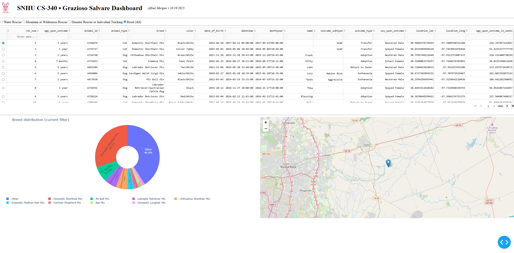
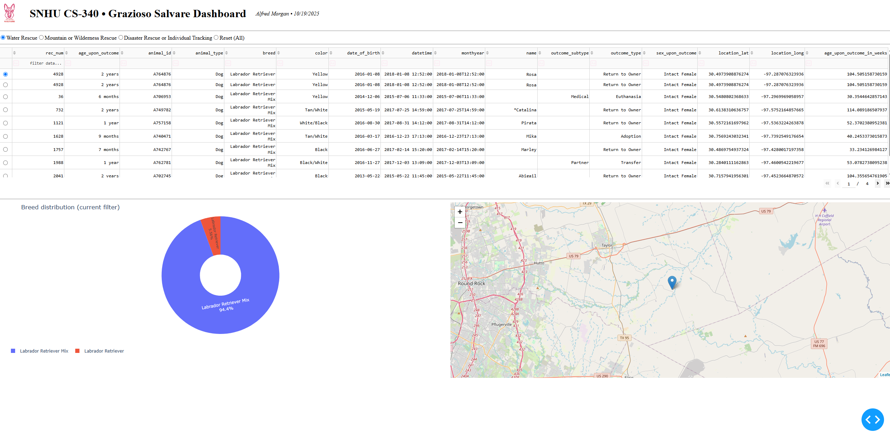
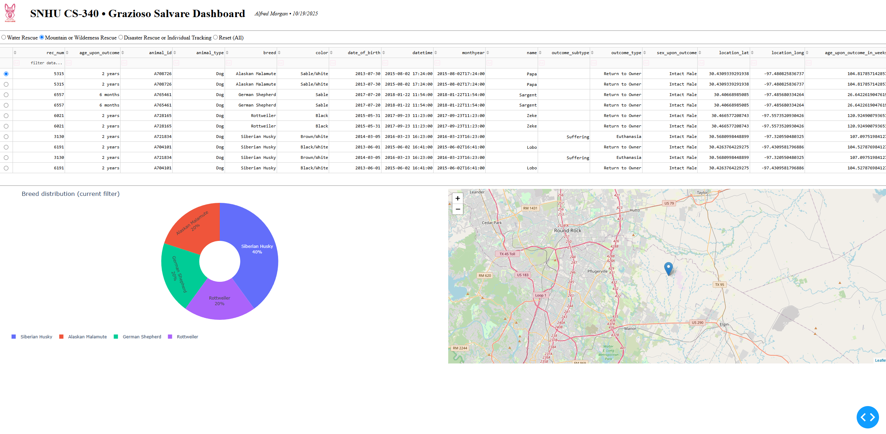
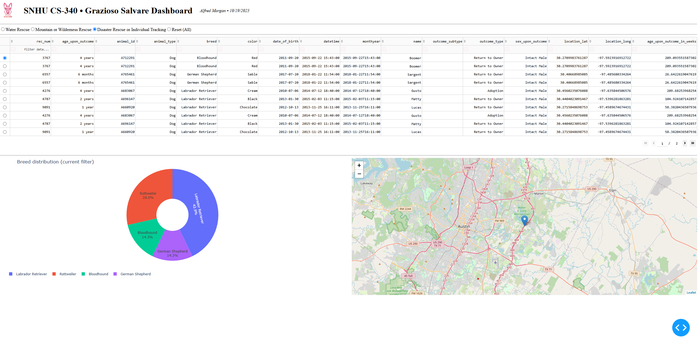

# Grazioso Salvare Dashboard
**Author:** Alfred Morgan  
**Date:** October 19, 2025  
**Course:** SNHU CS-340 – Client/Server Development  

---

## Overview
The Grazioso Salvare Dashboard project is a full-stack Python application for loading, visualizing, and managing animal data from the Austin Animal Center. The purpose of the application is to allow Grazioso Salvare to quickly identify animals that match criteria for various types of rescue missions such as water, mountain, and disaster rescues, or individual tracking.  

This project connects a MongoDB database to a browser-based web dashboard built using Dash, enabling the organization to filter, analyze, and map animal records by various fields directly through the interface.

---

## Functionality and Features
The Python backend implements full CRUD functionality through an `AnimalShelter` class that interfaces with MongoDB using `pymongo`. The application primarily uses the **Read** method to dynamically pull back records based on user input.  

When the dashboard loads, it displays all records in a searchable, sortable data table. Radio button filters allow the user to select a mission type, causing the table, pie chart, and map to update automatically with matching records. The available filters include:
- Water Rescue  
- Mountain or Wilderness Rescue  
- Disaster Rescue or Individual Tracking  
- Reset (All)

Selecting a record in the table centers the map on that animal’s coordinates and displays a marker with its name and breed. The pie chart updates in real time to show breed distribution for all filtered animals.  

Additional improvements include loading spinners for smoother user experience, table virtualization for performance, and a branded header displaying the Grazioso Salvare logo (linked to SNHU) and the author/date for project verification.

---

## Verification and Testing
The system successfully passed all functional and integration tests. The dashboard connects to MongoDB without issues, and all 20,002 records load from the database. Each rescue filter correctly returns the matching subset of animals. The pie chart displays the top eight breeds, grouping minor categories into “Other,” and the map updates dynamically when an animal is selected.  

The screenshots below show the dashboard working correctly for each scenario:

  
   <em>Figure 1: Dashboard Initial View</em>

  
   <em>Figure 2: Water Rescue Filter</em>

  
   <em>Figure 3: Mountain or Wilderness Rescue Filter</em>

  
   <em>Figure 4: Disaster Rescue Filter</em>

  
   <em>Figure 5: Reset (All) Restored Dataset</em>

---

## Tools and Frameworks
The following tools were used to develop and test the project:

- **MongoDB** – Chosen as the database model due to its schema-less design, scalability, and close similarity to Python dictionaries. MongoDB supports powerful operators such as `$in`, `$gte`, and `$lte`, allowing efficient data filtering and querying.
- **PyMongo** – Used to handle database connections and CRUD operations securely.
- **Dash Framework** – Provides both the view and controller for the web app, enabling a fully interactive dashboard built entirely in Python.
- **Dash Components** – Utilized `html.Div`, `dash_table.DataTable`, and `dcc.RadioItems` for layout; `plotly.express` for charting; and `dash_leaflet` for mapping.
- **JupyterDash** – Used to run and display the application inside Jupyter Notebook for development and testing.

This design demonstrates the **Model–View–Controller (MVC)** pattern:
- **Model:** MongoDB  
- **View/Controller:** Dash  
- **Glue Logic:** Python application and callback functions  

---

## Environment Setup
To reproduce this project:
1. Install MongoDB Community Server (v5+).
2. Import `aac_shelter_outcomes.csv` into the `aac.animals` collection.
3. Create a database user `aacuser` with password `watchdogman425` and grant read/write privileges.
4. Install required Python packages using `pip install -r requirements.txt`.  
   Packages include: `jupyter-dash`, `dash`, `dash-leaflet`, `plotly`, `pymongo`, `pandas`, and `matplotlib`.
5. Open `ProjectTwoDashboard.ipynb` in Jupyter Notebook and run the final cell to launch the app at  
   **http://127.0.0.1:8050/**
6. Click the local URL to open the dashboard in your browser.

---

## Challenges and Solutions
Several debugging issues arose during development:
- **Logo image error** was fixed by correcting the file path.  
- **MongoDB authentication errors** were resolved by adding the `authSource` parameter to the URI.  
- **Leaflet map disappearance** was fixed by assigning a minimum height to the container.  
- **Slow “Reset (All)” reloads** were improved by optimizing the `read()` query.  
- **Pie chart clutter** was reduced by limiting visible slices and grouping minor breeds into “Other.”  
- **Table and map responsiveness** were enhanced through table virtualization and loading indicators.

---

## Summary
The completed Grazioso Salvare Dashboard fulfills all project requirements by successfully connecting a CRUD backend with a responsive visual frontend. The dashboard dynamically filters animal data, updates visualizations in real time, and provides a clean, professional user experience. This project clearly demonstrates the integration of MongoDB as the model and Dash as the view/controller within a cohesive full-stack Python environment.

---

# Portfolio Reflection

## How do you write programs that are maintainable, readable, and adaptable?
Throughout Project One and Project Two, I learned the importance of structuring code for maintainability and clarity. Using the CRUD module from Project One allowed the application to separate database logic from dashboard logic, making the project modular and reusable. The `AnimalShelter` class encapsulates connection handling, query operations, and authentication so that future projects can reuse it by simply changing database parameters. Commenting, consistent naming conventions, and following Python’s PEP-8 standards ensured readability. This CRUD module could be reused in any future project where a Python application needs to interact with a MongoDB database.

---

## How do you approach a problem as a computer scientist?
Approaching this project required breaking the problem into distinct components—database connection, query design, and dashboard visualization. I began by ensuring database access and CRUD operations were correct before connecting them to the front-end Dash app. I used iterative testing to verify each part worked independently and then integrated them step by step. This systematic, modular approach is central to computer science problem solving. In future work, I would continue to use incremental development and debugging to build scalable, testable solutions that meet specific client requirements like those Grazioso Salvare outlined.

---

## What do computer scientists do, and why does it matter?
Computer scientists design, build, and optimize systems that solve real-world problems efficiently. In this project, I created a data-driven application that allows Grazioso Salvare to filter and visualize animal records for rescue operations. The dashboard makes large amounts of data accessible and actionable, improving the organization’s ability to plan and execute missions. This demonstrates how computer science helps organizations make better, data-informed decisions. The work matters because it transforms raw information into meaningful insights that directly support operational goals.

---

## Repository Link
[Link to GitHub Repository](https://github.com/alfredhm/Client-Server-Development)
